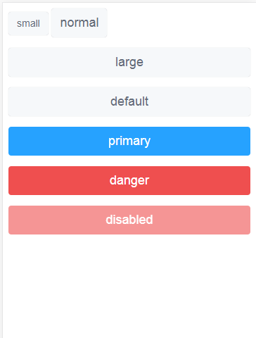

# tz-button

## 引入

```html
import { tz-button } from 'tz-ui'
或者
<tz-button></tz-button>
```

## 例子

### 改变颜色

```html
<tz-button type="default">default</tz-button>
<tz-button type="primary">primary</tz-button>
<tz-button type="danger">danger</tz-button>
```

### 改变大小

```html
<tz-button size="small">small</tz-button>
<tz-button size="large">large</tz-button>
<tz-button size="normal">normal</tz-button>
```

### 禁用按钮

```html
<tz-button disabled>disabled</tz-button>
```




### API

| 参数 | 说明         | 类型   | 可选值                   | 默认值  |
| ---- | ------------ | ------ | ------------------------ | ------- |
| type | 按钮显示样式 | String | default, primary, danger | default |
| size | 尺寸         | String | small, normal, large     | normal  |


